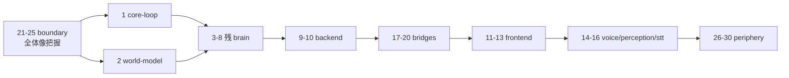

# HEMS コードレビュー 2026-05-30 — de-bloat 主軸 30 セッション

`docs/audit/2026-05-25/`(命名/スコープ/可読性/doc 乖離の 4 軸監査)の **後続パス**。
今回の主目的は **Coding Agent で肥大化したコードのスリム化(de-bloat)** + dead-code / bad-knowhow 検出。

設計図(承認済みプラン): `~/.claude/plans/lucky-skipping-horizon.md`。

## なぜ分割するか

HEMS は約 60k LOC(brain 22.7k / frontend 14.3k / backend 5.2k / bridges 8.3k / 他)。1 セッションで
全体を見るとコンテキストが溢れ浅い指摘しか出ない。**「クリーンな状態から始められる」自己完結セッション**に
割り、各セッションを新規 Claude セッションへ kickoff prompt(`REVIEW_PLAN.md`)を paste 起動する。
成果は `notes/REVIEW-<id>.md` に出力し、`LEDGER.md` で進捗を追う。

## レビューレンズ(全セッション共通)

**主軸 — de-bloat(各 finding に削減見込み LOC を付す)**
1. Dead code — 未使用 関数/メソッド/import/変数/dataclass・未配線 subsystem・空 dir・到達不能分岐・コメントアウト大ブロック。**grep で参照ゼロを実証**してから計上。
2. Duplication — near-duplicate・コピペ分岐・多重ソース定数・二重定義。統合候補を提示。
3. God-function / over-long module — 巨大関数の抽出単位を refactor-ready で。
4. Over-engineering — 使われない柔軟性・premature abstraction・1 実装しかない ABC・過剰な間接層。
5. Bad-knowhow — 例外握り潰し・find-replace 事故コメント・leading `_` 誤用・stale comment・magic number・facade 経由の準循環 import。

**従軸 — フル監査(軽量に)**
6. Correctness(race / silent failure / 境界条件)・7. Security(認証/injection/secrets/PII)・8. Doc 乖離。
※ 2026-05-25 で是正済の doc 乖離は **再修正せず検証のみ**。

出力は **P0 / P1 / P2** 分類 + `file:line`。

## 到達点 — ハイブリッド

- **低リスク(挙動不変)** = dead-code 削除・未使用 import 整理・明白な重複統合・stale comment 除去 →
  **別 worktree/ブランチで実装** → `make lint` + 該当 pytest 緑 → `git diff` 提示。
- **構造変更** = god-function 分割・抽象作り直し・schema 変更 → **実装せず提案**(削減見込み LOC 付き)。
- 安全策: 親が `git diff` を独立検証してからマージ。コア挙動に不安があれば「提案のみ」へ格下げ。

## baseline 連携

brain/backend/perception/voice/bridge 系は対応する `docs/audit/2026-05-25/<unit>.md` を**先に読む**。
前回 P1/P2 が生きているか検証(解消済→ resolved)。旧モデルの見落とし(特に bloat/dead/dup)を追加。
bridge は前回「行レベル精査は後続」とした内部(knowledge RRF/embedding・annotator/・voice_capsule/)を今回精読。

## セッション一覧(全 30)

| # | id | group | scope 要約 | baseline |
|---|---|---|---|---|
| 1 | brain-core-loop | brain | 認知ループ core + LLM client/router | brain-core-loop.md |
| 2 | brain-world-model | brain | world_model/(11) tri-domain state | brain-world-model.md |
| 3 | brain-rules-automation | brain | rule_engine + automation + rules/(9) + scheduler | brain-rules-automation.md |
| 4 | brain-tool-surface | brain | tool_executor/dispatch/registry + tool_schemas/(9) + sanitizer | brain-llm-tools-character.md |
| 5 | brain-tool-handlers-devices | brain | tool_handlers_*(9) + device_dispatcher/registry + scene | brain-llm-tools-character.md |
| 6 | brain-persona-voice | brain | character_loader + persona + system_prompt + voice_capsule/(7) | brain-llm-tools-character.md |
| 7 | brain-event-store-data | brain | brain_mqtt + dashboard_client + event_store/(5) + annotator/(6) | brain-world-model.md |
| 8 | brain-scheduling-power | brain | task_reminder + boot_load + low_power + timeline/(6) + task_scheduling/(4) | brain-core-loop.md |
| 9 | backend-routers | backend | routers/(27) | backend.md |
| 10 | backend-persistence | backend | main/database/models/schemas/auth/hmac_util + audio/ | backend.md |
| 11 | frontend-avatar | frontend | components/vrm/(14) + avatar hooks | — |
| 12 | frontend-dashboard | frontend | app/(5 pages) + components/(13 subdir) | — |
| 13 | frontend-data-layer | frontend | lib/api/(15) + lib/ + hooks/ + audio/(STT) | — |
| 14 | voice | service | TTS providers×5 + factory/generator/processor | voice.md |
| 15 | perception | service | RTMO detector + activity + vlm_scheduler(**未コミット変更あり**) | perception.md |
| 16 | stt | service | STT providers×3 + audio_utils/query_cleaner | voice.md(stt 部) |
| 17 | bridge-smarthome | bridge | ha / switchbot / tapo | ha/switchbot/tapo-bridge.md |
| 18 | bridge-ingestion | bridge | knowledge / biometric(PII) | knowledge/biometric-bridge.md |
| 19 | bridge-external-data | bridge | weather / news | weather/news-bridge.md |
| 20 | bridge-personal | bridge | gas / obsidian | gas/obsidian-bridge.md |
| 21 | bnd-mqtt-contract | boundary | publish↔subscribe マップ | — |
| 22 | bnd-http-rest | boundary | frontend↔backend↔brain REST/WS | — |
| 23 | bnd-tool-integrity | boundary | schema↔dispatch↔handler parity(現状緑) | — |
| 24 | bnd-config-env | boundary | env.example↔getenv↔compose | — |
| 25 | bnd-data-schema | boundary | backend models + event_store + stores | — |
| 26 | periphery-character-auth | periphery | validate_character + config/characters(**11 vs doc 6**) | — |
| 27 | periphery-infra-build | periphery | compose/Dockerfile/Makefile/pyproject + test 戦略 | — |
| 28 | infra-runtime-fixtures | periphery | infra/mock_llm + virtual_edge + eval | — |
| 29 | periphery-edge-firmware | periphery | edge/(43py + 4 C/ino) | — |
| 30 | periphery-mobile-kotlin | periphery | mobile-android(49f) + healthconnect-companion(8 kt) | — |

## 推奨実行順

boundary を先に通すと全体の契約マップが頭に入り、各サービスセッションで「これは別所有」と即断できる。

## 除外(レビュー対象外。理由を明記)

| 対象 | 理由 |
|---|---|
| `openclaw` / `localcraw` | build context が `../../localcraw`(リポジトリ外)。in-repo source 無し。外部依存として記録のみ |
| `services/data-bridge/` | `README.md` のみの Phase-2 scaffold(`src/` 無し)。N/A |
| `yukari/` | 市販音声ソフト(AI VOICE 結月ゆかり)のインストーラ/binary。3rd-party vendored asset、コードでない |
| `config/`(characters 除く) | 純 YAML / データ。実行コード py=0 |
| `services/brain/src/data/` | **実在する空 dir**(root 所有, 05-16 作成)。dead orphan として #26/#27 で削除検討 |
| node_modules / __pycache__ / build 生成物 | 生成物。git 未追跡(クリーン) |

## doc 乖離候補(レビューで確認・記録)

- `CLAUDE.md` の character テンプレート列挙が **6 個**だが実体は **11 個**(config/characters/ に
  butler/default/ena/gentle-senpai/nurserobo-typet/tsundere/una/una-jinin/yukari/yukari-jinin/yukari-doukyonin)。→ #26 で記録。
- 上位 `hems/` ディレクトリは dead duplicate 疑い(別途検証で import 参照ゼロ)。→ #26 で削除検討。
- root `CLAUDE.md` の MQTT prefix `hems/{tapo,switchbot}/*` は switchbot device state が実は `hems/home/*`(HA 互換)で誤解を招く(2026-05-25 既出、#21 で検証)。

## 関連

- 前回監査: [`docs/audit/2026-05-25/`](../2026-05-25/README.md)
- リファクタ台帳: [`docs/refactor/2026-05-25/LEDGER.md`](../../refactor/2026-05-25/LEDGER.md)
- SoT: [`docs/IMPLEMENTATION_MAP.md`](../../IMPLEMENTATION_MAP.md) / [`docs/CLAUDE-bridges.md`](../../CLAUDE-bridges.md)
